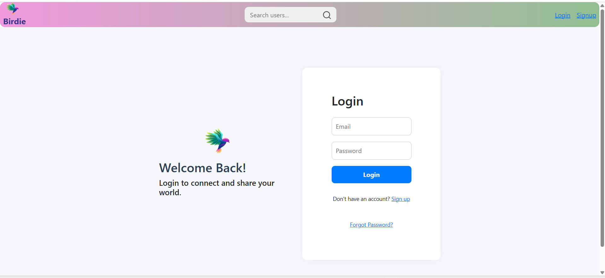
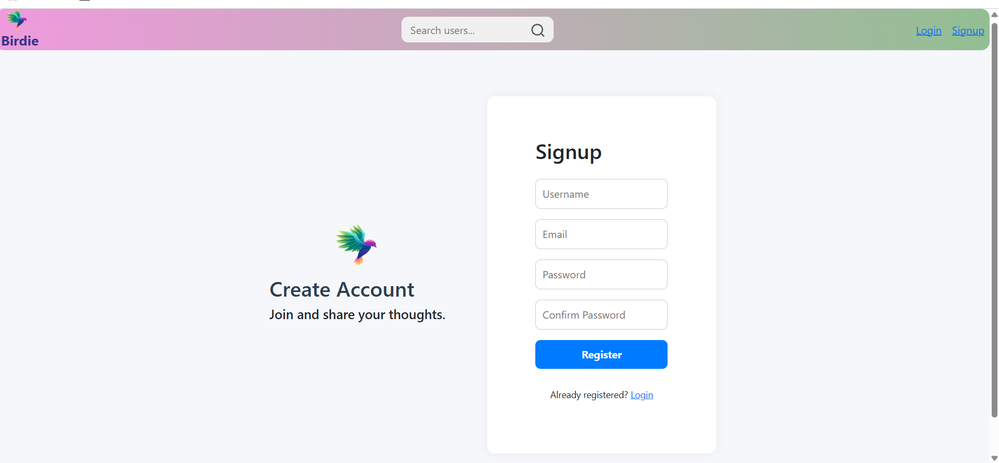
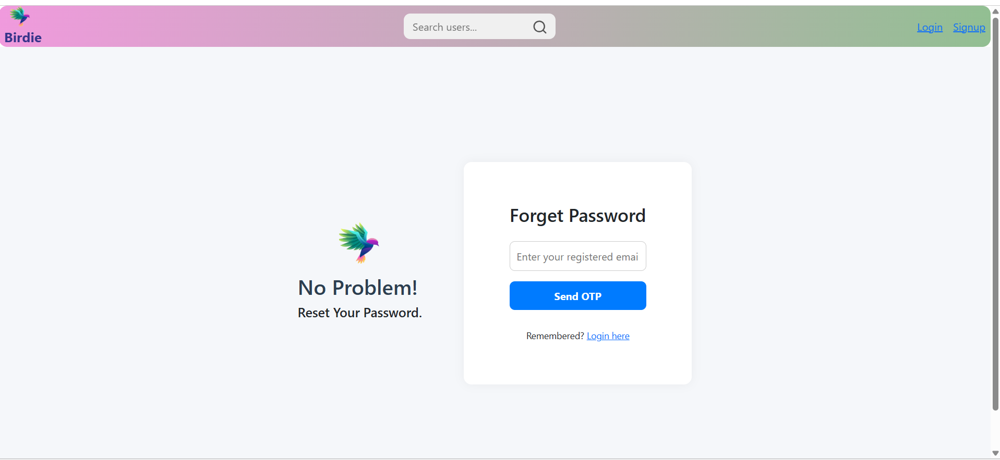
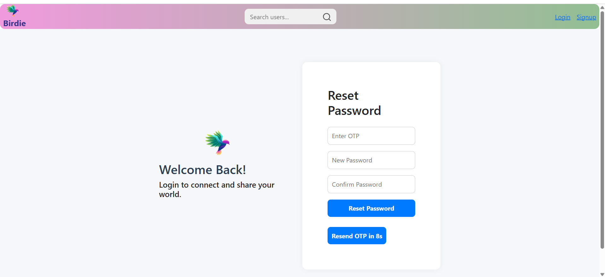
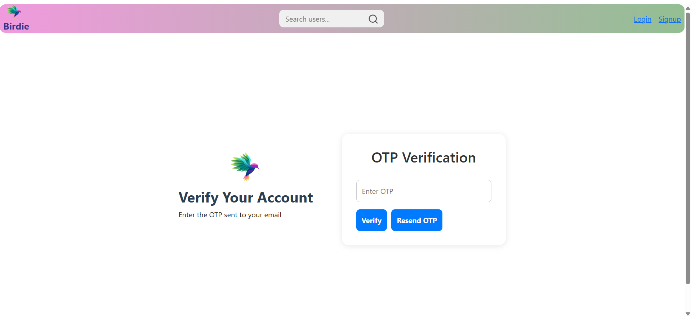
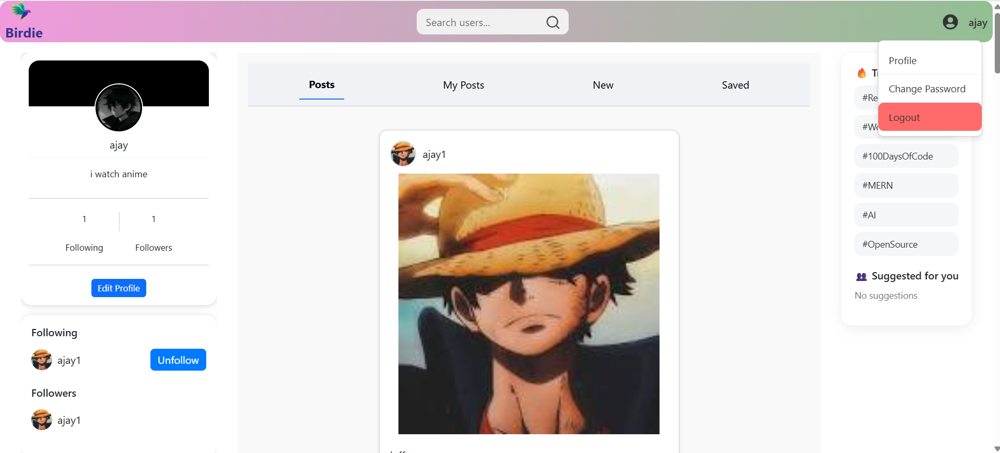
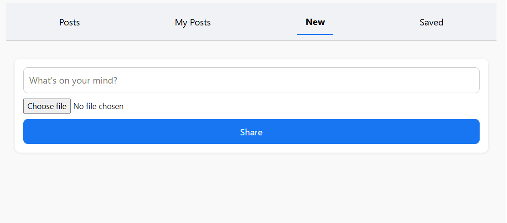

# 🔗 Social Media App

A full-stack social media web application built with the **MERN stack (MongoDB, Express, React, Node.js)** that allows users to create, like, comment, save posts, and manage profiles — all in a responsive, modern UI.

---

## 📸 Screenshots

| Feature | Image |
|--------|-------|
| Login Page |  |
| Signup Page |  |
| Forgot Password |  |
| Reset Password |  |
| Verify Page |  |
| Home Page |  |
| New Post |  |

---

## 🚀 Features

- 🔐 **Authentication**: Signup, login, email verification, forgot/reset password
- 📝 **Posts**: Create, edit, delete, like/unlike, comment, save/unsave posts
- 👤 **User Profiles**: View and edit profile info, including profile picture
- 📄 **Responsive UI**: Clean layout with tabs for "My Posts", "Saved", "All"
- ⚙️ **Protected Routes**: User authentication managed via tokens
- ☁️ **Backend APIs**: RESTful APIs with Express.js

---

## 🧰 Tech Stack

| Frontend           | Backend              | Database |
|--------------------|----------------------|----------|
| React.js (Vite)    | Node.js, Express.js  | MongoDB  |
| Redux Toolkit      | JWT Authentication   | Mongoose |
|  CSS               | Multer, Cloudinary   |          |

---

## 🛠️ Installation

### 1. Clone the repository

```bash
git clone https://github.com/kothaajay456/social-media-app.git

cd social-media-app
cd Backend
npm install
npm run dev

cd ../Frontend/Frontend
npm install
npm run dev
